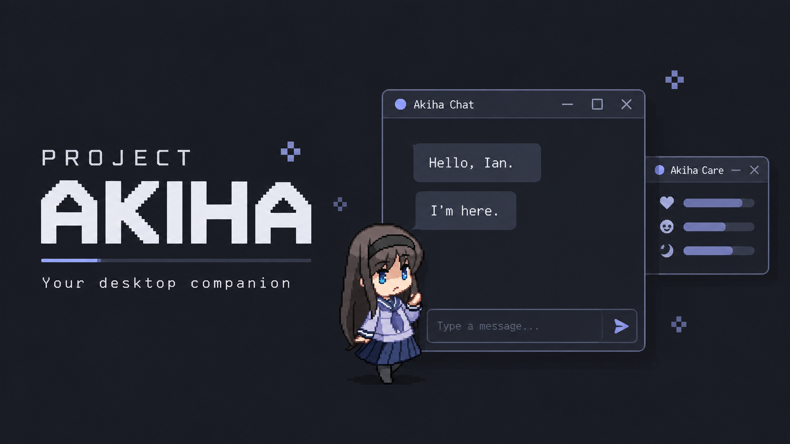

<p align="center">
  
</p>

# Project Akiha

A Windows-first, local-first AI desktop companion with an animated pet,
persistent memory, optional voice, and permission-gated assistant actions.

[Quick start](#quick-start) · [Architecture](#architecture) ·
[Privacy](#security-and-privacy) · [Documentation](docs/README.md) ·
[Roadmap](#roadmap)

> **Status:** Personal project under active development. Phases 1–12 are
> complete; Phase 13 (everyday assistant utilities) is in progress.

## Meet Akiha

Akiha lives on your desktop as a draggable, animated companion. Chat with her,
review what she remembers, care for her, and enable the voice or desktop
integrations you want to use. Activity awareness, mood, progression, and
quiet-hours controls help her feel present without demanding constant attention.

The app starts with a deterministic mock chat provider, so you can explore the
pet and UI without an API key. Connect a local model or explicitly choose a
hosted provider when you want AI conversation.

## Features

- **Desktop companion:** transparent pet window, tray controls, pixel-art
  animation, and staged sleep and wake transitions.
- **Streaming chat and memory:** swappable AI providers, conversation history,
  summaries, and durable memories with configurable approval and management tools.
- **Optional voice:** local faster-whisper recognition and streamed Japanese
  GPT-SoVITS speech, interruption, multi-turn conversation, and optional English
  subtitles. Gemini Live offers a separately enabled cloud-audio mode.
- **Pet care and progression:** persistent needs, care actions, levels, currency,
  a shop/appearance system, and locally controlled idle, wander, and rest behavior.
  Additional appearances depend on validated, approved artwork.
- **Scoped desktop assistance:** discover files inside approved directories,
  open supported files and local media, and launch or gracefully close
  allowlisted applications.
- **Optional integrations:** Spotify playback, read-only Gmail metadata
  notifications, and Discord awareness through an official bot account.
- **Notification controls:** a notification inbox, aggregation, quiet hours,
  cooldowns, and configurable delivery channels.

Timers, durable reminders, and weather/current-information utilities are planned
in Phase 13; they are not available features yet.

## What Makes Akiha Different

**The application owns execution authority.** AI providers can propose actions,
but every proposal is untrusted. Typed validation, scoped permissions,
confirmation rules, allowlisted executors, and sanitized audit history sit
between a model response and a desktop action.

**Companion behavior has its own state.** Pet needs, progression, and autonomous
activities follow structured local rules rather than being inferred from model
dialogue. Chat, memory, voice, and integrations can evolve independently.

**You choose where processing happens.** Local, hybrid, and hosted voice modes
are explicit choices. A provider failure never silently switches processing to
another local or cloud service.

## Architecture

Akiha uses a layered, event-driven architecture with a framework-free core:

```text
PySide6 UI  <-->  Application controllers
                         |
                 Core models and policy
                         |
          Providers · Repositories · Services · Integrations
```

- `core/` contains domain models and policy without Qt, concrete providers,
  or Windows API dependencies.
- `app/` wires dependencies and coordinates use cases; `ui/` owns presentation.
- Providers handle AI and voice; repositories isolate SQLite persistence.
- Memory flows through extraction, normalization, validation, storage, retrieval,
  and prompt-context assembly.
- External integrations enter through typed service boundaries. Assistant
  actions always pass through the application-owned permission pipeline.

See the [codebase map](docs/reference/CODEBASE_STRUCTURE.md) for module ownership.

## Security and Privacy

- **Local persistence:** settings, conversations, memories, pet state, and logs
  live under `%LOCALAPPDATA%\Akiha\`. There is no cloud sync.
- **Explicit off-device processing:** hosted chat can receive prompts, recent
  messages, retrieved memories, and summaries. Hosted live voice requires
  separate consent to stream microphone audio. Remote provider URLs also send
  data off-device.
- **Protected credentials:** credentials entered in Settings use Windows DPAPI
  encryption for the current Windows user, separate from ordinary TOML settings.
- **Limited action scope:** grants are revocable. The assistant action system
  rejects arbitrary shell execution, elevation, arbitrary executables, and
  filesystem mutation.
- **Bounded communication awareness:** Gmail uses metadata-only access. Discord
  uses bot DMs, mentions, and authorized channels; it cannot monitor a normal
  user's private DMs. Raw message bodies and attachments are neither persisted
  nor sent to an LLM by these integrations.

Details: [local data and privacy](docs/reference/LOCAL_DATA_PRIVACY.md) ·
[security review](docs/reference/SECURITY_REVIEW.md).

## Tech Stack

| Layer | Technologies |
| --- | --- |
| Desktop | Python 3.12+, PySide6 / Qt 6 |
| Persistence | SQLite, TOML configuration |
| AI | Mock provider, Ollama, OpenAI-compatible endpoints |
| Optional voice | faster-whisper, GPT-SoVITS, Google Gen AI SDK for Gemini Live |
| Quality | unittest, Ruff, Black |
| Windows packaging | PyInstaller for development, Nuitka for release candidates |

## Quick Start

Use **Windows and Python 3.13** for the documented setup below. The base app
supports Python 3.12+; Python 3.13 is the project's voice and packaging environment.

From a local checkout of this repository, run these commands in PowerShell:

```powershell
py -3.13 -m venv .venv313
.\.venv313\Scripts\python.exe -m pip install -e ".[dev]"
.\.venv313\Scripts\python.exe -m project_akiha.app.main
```

No environment activation is required. The first launch uses mock chat with
voice and external integrations disabled. Open **Settings** from the pet menu
or tray to configure a provider. Ollama requires a separately installed local
server and model; hosted providers require your own credentials.

See [AI provider setup](docs/reference/AI_PROVIDERS.md) for configuration.

### Optional Voice and Integrations

Install only the extras you need into the same environment:

```powershell
# Local speech recognition
.\.venv313\Scripts\python.exe -m pip install -e ".[voice]"

# Gemini Live cloud audio
.\.venv313\Scripts\python.exe -m pip install -e ".[live]"

# Discord Bot Gateway transport
.\.venv313\Scripts\python.exe -m pip install -e ".[integrations]"
```

The `voice` extra installs speech recognition; GPT-SoVITS needs a separate
runtime, models, and reference audio. Once configured, select **GPT-SoVITS**
and **Start local TTS automatically** in **Settings > Voice** to let Akiha manage
its local API process. See the [voice documentation](docs/phases/phase-07-voice/README.md)
and [voice-mode architecture](docs/roadmap/VOICE_INTELLIGENCE_V0_V8.md).

Gmail uses the standard-library HTTP transport. Gmail, Discord, and Spotify each
need separate account/application setup and explicit enablement; installing an
extra does not connect an account. See [communication integrations](docs/phases/phase-11-integrations/README.md)
and [Spotify setup](docs/phases/phase-08-actions/SPOTIFY_INTEGRATION.md).

## Testing

After installing the `dev` extra, run from the repository root:

```powershell
.\.venv313\Scripts\python.exe -m unittest discover tests
.\.venv313\Scripts\python.exe -m ruff check project_akiha tests
.\.venv313\Scripts\python.exe -m black --check project_akiha tests
.\.venv313\Scripts\python.exe -m compileall project_akiha tests
```

Packaging commands, build caches, and release verification are documented in the
[build and release workflow](docs/phases/phase-06-packaging/BUILD_RELEASE.md).
Real-device checks are covered by the
[packaged smoke checklist](docs/phases/phase-06-packaging/MANUAL_PACKAGED_SMOKE.md).

## Documentation

| Guide | Contents |
| --- | --- |
| [Documentation index](docs/README.md) | Phase records, shared references, and historical evidence |
| [Codebase structure](docs/reference/CODEBASE_STRUCTURE.md) | Source layout and ownership boundaries |
| [AI providers](docs/reference/AI_PROVIDERS.md) | Local and hosted chat configuration |
| [Local data and privacy](docs/reference/LOCAL_DATA_PRIVACY.md) | Stored data and provider disclosures |
| [Assistant actions](docs/phases/phase-08-actions/README.md) | Permissions, supported actions, and audit behavior |
| [Build and release](docs/phases/phase-06-packaging/BUILD_RELEASE.md) | Packaging and verification workflows |

## Roadmap

| Area | Status |
| --- | --- |
| Desktop companion, chat, memory, and proactive behavior | Implemented |
| Local voice, Gemini Live, and provider-proposed actions | Implemented |
| Pet care, progression, shop, and autonomous activity | Implemented; additional appearance artwork remains gated |
| Gmail/Discord awareness and runtime/notification reliability | Implemented |
| Everyday assistant utilities | In progress: contracts complete; clarification and confirmation next |

The [Phase 13 plan](docs/phases/phase-13-assistant-utilities/README.md) covers
timers, reminders, read-only weather/current information, contextual directory
navigation, and privacy-safe export. Detailed milestones and acceptance records
live in the [documentation index](docs/README.md); deferred work lives in the
[project backlog](docs/roadmap/PROJECT_BACKLOG.md).

## Project and License Notes

Project Akiha is a personal project inspired by Akiha Tohno from *Tsukihime*.
It is not an official TYPE-MOON product. Character and third-party asset rights
remain with their respective owners.

This repository does not currently include a license file. No open-source
license is declared here for the code or bundled assets.
